<style>
@page { size: A4; margin: 9mm 11mm; }
html, body { background: #fff; }
body { font: 8.3pt/1.32 -apple-system, "Helvetica Neue", Arial, sans-serif; color: #161616; margin: 0; padding: 0; max-width: none; }
h1 { font-size: 14.5pt; margin: 0 0 1pt; border: 0; padding: 0; }
h2 { font-size: 10.8pt; margin: 7pt 0 3pt; padding: 0 0 1.5pt; border-bottom: 1.2px solid #444; }
h3 { font-size: 8.9pt; margin: 5pt 0 2pt; }
p { margin: 2pt 0 3.5pt; }
ul { margin: 2pt 0 3pt; padding-left: 13pt; }
li { margin: 0 0 1.5pt; }
body code { font: 7.4pt Menlo, "SF Mono", Consolas, monospace; background: #f0f0f0; border: 0; padding: 0 1.5px; border-radius: 2px; }
pre { font: 6.9pt/1.28 Menlo, "SF Mono", Consolas, monospace; background: #f5f5f5; border: 1px solid #e2e2e2; padding: 3.5pt 5pt; margin: 3pt 0 4pt; border-radius: 3px; white-space: pre-wrap; overflow: hidden; }
body pre code { display: block; background: none; border: 0; padding: 0; font: inherit; }
table { border-collapse: collapse; margin: 3pt 0 4pt; font-size: 7.9pt; width: 100%; }
th, td { border: 1px solid #c4c4c4; padding: 1.4pt 4pt; text-align: left; vertical-align: top; }
th { background: #efefef; }
table, tr { break-inside: avoid; }
.ge { display: grid; grid-template-columns: 1.62fr 1fr; gap: 5pt; align-items: start; margin: 3pt 0; }
.ge pre { font-size: 6.2pt; padding: 3pt 4pt; }
img { max-width: 100%; }
.meta { font-size: 8pt; color: #333; margin: 0 0 4pt; }
.box { background: #f3f7fb; border-left: 3px solid #3d6fa8; padding: 3pt 6pt; margin: 3pt 0 4pt; }
.g2 { display: grid; grid-template-columns: 1fr 1fr; gap: 5pt; align-items: start; margin: 3pt 0; }
.g2b { display: grid; grid-template-columns: 3.2fr 1fr; gap: 7pt; align-items: start; margin: 3pt 0; }
.gd { display: grid; grid-template-columns: 1.34fr 1fr; gap: 5pt; align-items: start; margin: 3pt 0; }
.gd pre { font-size: 6.2pt; padding: 3pt 4pt; }
.g2 pre { font-size: 6.5pt; }
h2, h3 { break-after: avoid; }
.g2b { grid-template-columns: 3.6fr 1fr; }
.g2n { display: grid; grid-template-columns: 0.86fr 1.14fr; gap: 5pt; align-items: start; margin: 3pt 0; }
.g2n pre { font-size: 6.5pt; }
figure { margin: 0 0 3pt; break-inside: avoid; }
figure img { width: 100%; display: block; border-radius: 2px; }
figcaption { font-size: 7pt; color: #555; margin-top: 1pt; }
.brk { break-before: page; }
.small { font-size: 7.6pt; color: #444; }
</style>

# Assignment 3: End-to-End ML Versioning with Git, DVC &amp; Google Drive

<p class="meta"><b>Samiha Hamid</b> · Roll no. 23L-1018 · <b>Repository:</b> https://github.com/Mia131103/fashion-ann-pipeline · <b>DVC remote:</b> Google Drive folder <code>1ngK-GvQZZmEW2jNMASRhXAomcZwGj07z</code> · <b>Tags:</b> <code>v1</code> = 7b71205, <code>v2</code> = 1493de1 · <b>Final merge:</b> <code>main</code> @ 9d5d291</p>

<div class="box">The ANN reaches <b>87.74 %</b> (v1) and <b>88.14 %</b> (v2) test accuracy, above the 85 % target. The pipeline runs end-to-end with one <code>dvc repro</code>, and every data/model version is on the Google Drive remote (sync check in E5).</div>

## Part A: Git fundamentals and advanced commands

**A1–A2.** First commit `6fee428` on `main`: README.md and a `.gitignore` for `.venv`, `__pycache__/`, `*.py[oc]` (later `.env`, `/models`; see C4). `dev` (`git checkout -b dev`) then received **21 commits**, about one per script or config: `7f5d237` prepare.py · `dfb8989` preprocess.py + params.yaml · `73c5015` train.py · `1663628` evaluate.py · `c5f22d0` dvc init · `0e53484` dvc add · `7b71205` dvc.yaml (**v1**) · `1493de1` params (**v2**).

### A3. Log variants (captured when `dev` was one commit ahead of `main`)

<div class="g2">
<div>
<figure>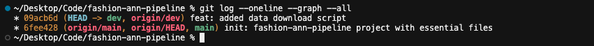<figcaption><b>--oneline --graph --all</b>: one line per commit across all branches and remotes, with the topology drawn (plain <code>git log</code> shows only the current branch, verbosely).</figcaption></figure>
<figure>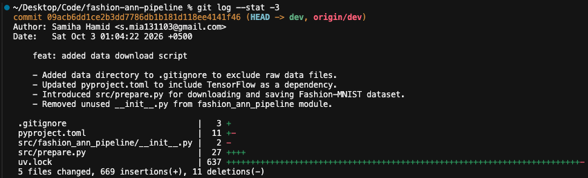<figcaption><b>--stat -3</b> (cropped): files touched by each of the last 3 commits, with insertion/deletion counts.</figcaption></figure>
</div>
<div>
<figure>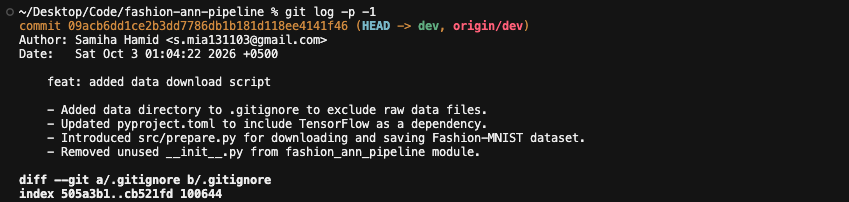<figcaption><b>-p -1</b> (cropped): the full patch of the latest commit, i.e. what changed line by line.</figcaption></figure>
<figure>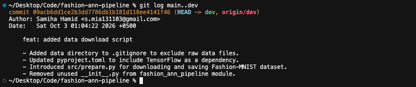<figcaption><b>main..dev</b>: only commits on dev that are not on main, i.e. what merging dev would bring in.</figcaption></figure>
</div>
</div>

### A4. Diff variants

<div class="g2">
<figure>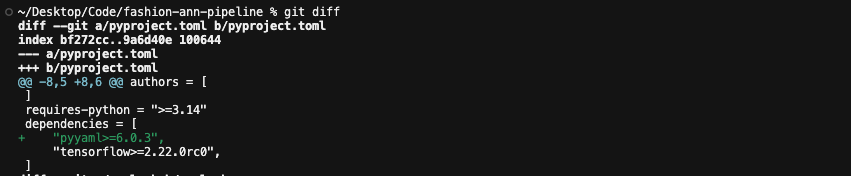<figcaption>(a) git diff: working tree vs index (unstaged pyyaml addition)</figcaption></figure>
<figure>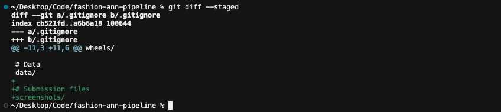<figcaption>(b) git diff --staged: index vs HEAD (staged .gitignore line)</figcaption></figure>
<figure>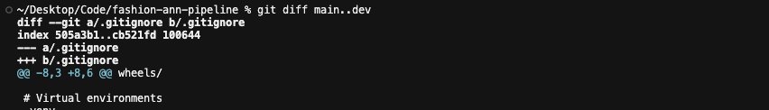<figcaption>(c) main..dev (cropped)</figcaption></figure>
<figure>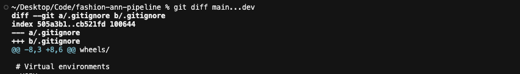<figcaption>(c) main...dev (cropped)</figcaption></figure>
</div>

**Two-dot vs three-dot.** `main..dev` compares the two **tips**, so commits made on `main` after branching show up too, reversed. `main...dev` compares the **merge-base** with `dev`: only what `dev` introduced. The screenshots match because `main` had not moved yet; the Part E branches show the difference:

```text
$ git diff --stat b704885..teammate-sim     # tip vs tip
 src/preprocess.py | 26 ++++++++++++++++++--------   ← includes main's own "/ 127.5 - 1.0" change, reversed
$ git diff --stat b704885...teammate-sim    # merge-base vs tip
 src/preprocess.py | 22 ++++++++++++++++------      ← only teammate-sim's scale()/standardize()
```

### A5. Stash

<div class="g2n">
<figure>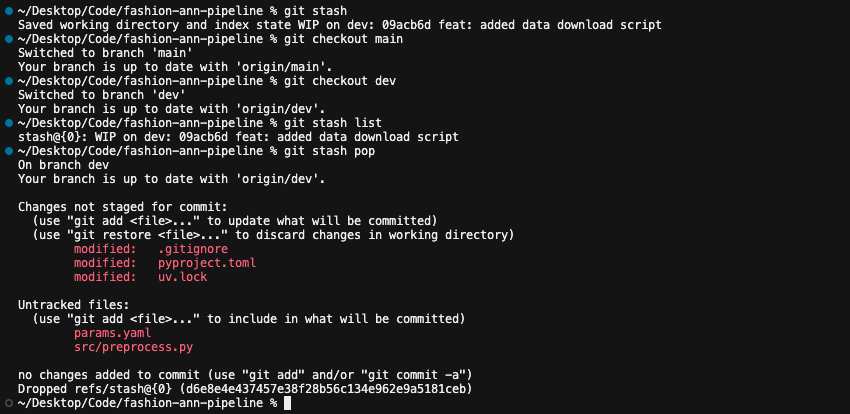<figcaption>Original run</figcaption></figure>
<div>
<p class="small">Here <code>preprocess.py</code> was still <i>untracked</i>, so plain <code>git stash</code> left it in the working tree (<code>-u</code> would include it). Repeated once it was tracked:</p>

```text
$ git stash          # with src/preprocess.py modified
Saved working directory and index state WIP on dev: 1493de1
$ git switch main && git switch dev
$ git stash list
stash@{0}: WIP on dev: 1493de1 feat: enhance model …
$ git stash pop
        modified:   src/preprocess.py
```

</div>
</div>

### A6. Rebase onto a hotfix

<div class="g2">
<div>
<figure>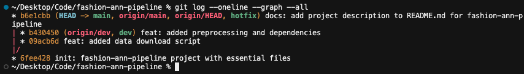<figcaption>Before</figcaption></figure>
<figure>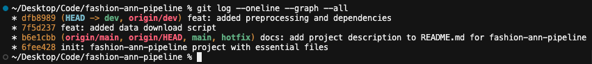<figcaption>After <code>git rebase main</code></figcaption></figure>
</div>
<p class="small"><code>hotfix</code> (from <code>main</code>) got one README fix, <code>b6e1cbb</code>, and was fast-forward merged into <code>main</code>. <code>git rebase main</code> on <code>dev</code> then replayed dev's commits on top as <b>new</b> commits (<code>09acb6d→7f5d237</code>, <code>b430450→dfb8989</code>): linear history, no merge commit. No conflict arose since <code>dev</code> never touched README.md (reflog: <code>rebase (finish): refs/heads/dev onto b6e1cbb</code>).</p>
</div>

### A7. Reset (soft vs hard)

<div class="g2">
<figure>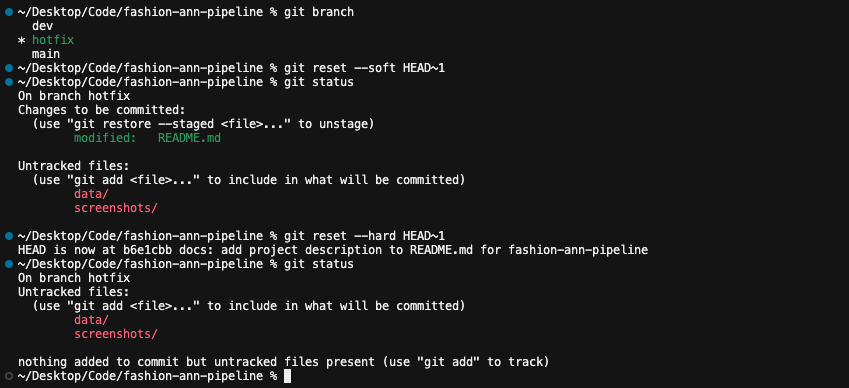</figure>
<div>

```text
# git reflog (scratch branch = the already-merged hotfix)
6d0e33a commit: docs: added throwaway commit 1
01aebe7 commit: docs: added throwaway commit 2
6d0e33a reset: moving to HEAD~1   ← --soft
b6e1cbb reset: moving to HEAD~1   ← --hard
```

<p class="small"><b>Observed:</b> <code>--soft</code> moved only the branch pointer, so the undone edit stayed staged. <code>--hard</code> also reset the index and working tree: the edit was discarded and only untracked files remained.</p>
</div>
</div>

### A8. `git mv` and `git rm`

<div class="g2">
<figure>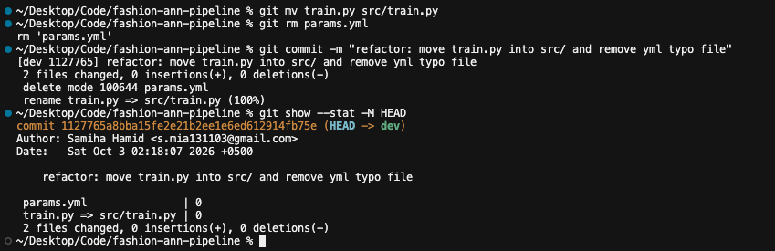</figure>
<p class="small"><code>git mv train.py src/train.py</code> and <code>git rm params.yml</code> (a typo duplicate of <code>params.yaml</code>) in one commit, <code>1127765</code>. Git records a <code>rename … (100%)</code> and a <code>delete mode</code>, not a delete plus a new file, so <code>git log --follow src/train.py</code> keeps the history.</p>
</div>

## Part B: Modular TensorFlow ANN pipeline

<div class="g2b">
<div>

| Script | Reads → writes | What it does |
|---|---|---|
| `prepare.py` | Keras dataset → `data/raw/{train,test}.npz` | Saves the raw 60k / 10k uint8 28×28 images; no params. |
| `preprocess.py` | `data/raw` → `data/processed/{train,val,test}.npz` | Seeded shuffle, `val_split` 0.1 → 54k / 6k / 10k; scales to [0, 1] (v1, v2), and since Part E also standardizes. |
| `train.py` | `processed/{train,val}` → `models/model.h5`, `history.csv` | Flatten → Dense(`hidden_units`, ReLU) → Dropout(`dropout_rate`) → Dense(10, softmax); Adam(`learning_rate`), sparse categorical CE, seeded. |
| `evaluate.py` | `model.h5` + `processed/test` → `metrics.json`, `confusion_matrix.png` | Test loss and accuracy, plus the confusion-matrix image. |

<p class="small">Each script runs standalone (<code>python src/&lt;name&gt;.py</code>) and takes its hyperparameters from <code>params.yaml</code> (see D1). In the confusion matrix, <i>Shirt</i> is the weakest class (643/1000), mostly confused with T-shirt, Pullover and Coat.</p>
</div>
<figure>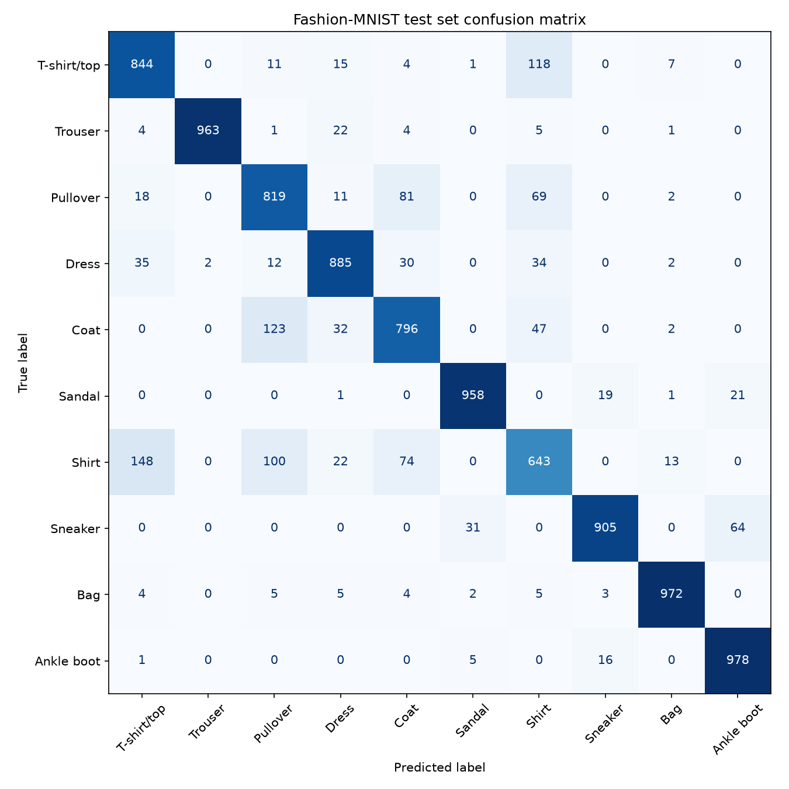<figcaption>models/confusion_matrix.png</figcaption></figure>
</div>

## Part C: DVC with Google Drive as remote

- **C1.** `dvc` + `dvc-gdrive` installed in the project venv (via uv; equivalent to `pip install "dvc[gdrive]"`). `dvc doctor` → `DVC version: 3.67.1`, `Supports: gdrive (pydrive2 = 1.21.2)`. `cryptography<44` was pinned for compatibility (`c986e14`).
- **C2.** `dvc init` ran on **dev** after the Part A commits (`c5f22d0`: `.dvc/config`, `.dvc/.gitignore`, `.dvcignore`); re-initialised once on dev (`a669c5d`) when switching to a personal OAuth client.
- **C3.** `dvc remote add -d gdriveremote gdrive://1ngK-GvQZZmEW2jNMASRhXAomcZwGj07z` (first named `gdrive_storage`, renamed in `35d1eb5`).
- **C4.** Google blocks DVC's shared OAuth app, so a personal OAuth client is used. Its ID/secret are in the git-ignored **`.dvc/config.local`** (the committed `.dvc/config` has only ever held placeholders). The OAuth token is cached at `~/Library/Caches/pydrive2fs/<client-id>/default.json`, **outside the repository**. The ignore rules are verified below.
- **C5.** `dvc add data/raw data/processed models` → `data/raw.dvc`, `data/processed.dvc`, `models.dvc` and `data/.gitignore`, committed in `0e53484`, then `dvc push`. When `dvc.yaml` arrived (`7b71205`) these were removed, since a path cannot be both a `dvc add` target and a stage output; the same hashes moved into `dvc.lock`.

<div class="g2">
<div>

```text
# data/processed.dvc (commit 0e53484)
outs:
- md5: 005380317322710a7d01e06eed8e6cd0.dir
  size: 45391160
  nfiles: 3
  path: processed
```

```text
$ git check-ignore -v .env .dvc/config.local .dvc/cache models/model.h5 data/processed
.gitignore:14:.env               .env
.dvc/.gitignore:1:/config.local  .dvc/config.local
.dvc/.gitignore:3:/cache         .dvc/cache
.gitignore:20:/models            models/model.h5
data/.gitignore:2:/processed     data/processed
```

</div>
<figure>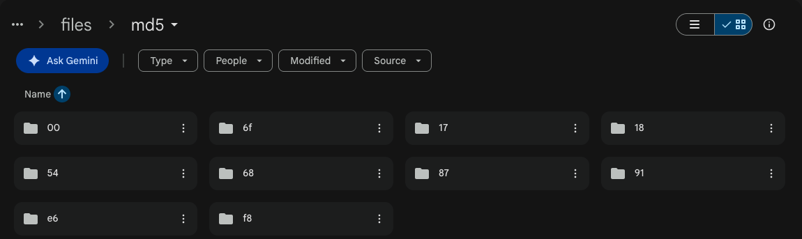<figcaption>Drive remote after <code>dvc push</code>: DVC's content-addressed cache (files/md5/…)</figcaption></figure>
</div>

## Part D: DVC pipeline (params.yaml + dvc.yaml)

<div class="gd">
<div>

```yaml
# params.yaml (final, verbatim)
preprocess:
  val_split: 0.1  # fraction of the training data held out for validation
  seed: 42        # RNG seed for the shuffle before splitting

train:
  hidden_units: 256     # neurons in the Dense (ReLU) layer
  dropout_rate: 0.2     # fraction of units dropped after the hidden layer
  learning_rate: 0.001  # Adam learning rate
  epochs: 10
  batch_size: 32
  seed: 42              # seed for Python / NumPy / TensorFlow RNGs
```

**D1.** `preprocess.py` and `train.py` read their own section with `yaml.safe_load()` (optional `--params` path); nothing is hard-coded.

**D2.** Each stage lists its script and inputs as `deps` and exactly the `params` keys it reads. `metrics.json` is a `metrics` entry with `cache: false`, so it stays in Git where `dvc metrics diff` can compare versions.

</div>
<div>

```yaml
# dvc.yaml (final; lists shown in flow style,
# the committed file uses block style)
stages:
  prepare:
    cmd: python src/prepare.py
    deps: [src/prepare.py]
    outs: [data/raw]
  preprocess:
    cmd: python src/preprocess.py
    deps: [src/preprocess.py, data/raw]
    params: [preprocess.val_split, preprocess.seed]
    outs: [data/processed]
  train:
    cmd: python src/train.py
    deps: [src/train.py, data/processed/train.npz,
           data/processed/val.npz]
    params: [train.hidden_units, train.dropout_rate,
             train.learning_rate, train.epochs,
             train.batch_size, train.seed]
    outs: [models/model.h5, models/history.csv]
  evaluate:
    cmd: python src/evaluate.py
    deps: [src/evaluate.py, models/model.h5,
           data/processed/test.npz]
    outs: [models/confusion_matrix.png]
    metrics:
      - metrics.json:
          cache: false
```

</div>
</div>

<div class="g2">
<figure>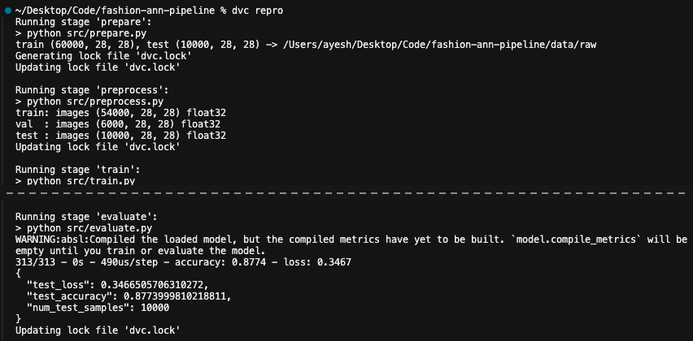<figcaption><b>D3</b>: first <code>dvc repro</code>; all four stages run and dvc.lock is generated (model summary and epochs cut at the dashed line).</figcaption></figure>
<figure>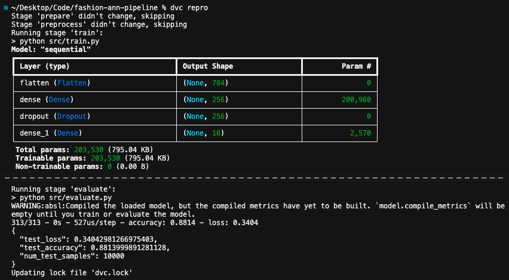<figcaption><b>D4</b>: <code>dvc repro</code> after <code>hidden_units</code> 128 → 256.</figcaption></figure>
</div>

**D4: what re-ran and why.** `prepare` and `preprocess` were **skipped**; `train` and `evaluate` **re-ran**. DVC compares the hashes of each stage's `deps` and declared `params` with `dvc.lock`. Only `train` declares `train.hidden_units`, so only it was stale; its new `model.h5` is a dependency of `evaluate`, so that re-ran too. Nothing the first two stages depend on had changed.

**D5.** `params.yaml`, `dvc.lock` and `metrics.json` committed and tagged **`v2`** (`1493de1`; `dvc.yaml` was already in `v1`), then `dvc push`.

| Version | `train.hidden_units` | Trainable params | Val. acc. (epoch 10) | **Test accuracy** | Test loss |
|---|---|---|---|---|---|
| `v1` (7b71205) | 128 | 101,770 | 0.8918 | **0.8774** | 0.3467 |
| `v2` (1493de1) | 256 | 203,530 | 0.8922 | **0.8814** | 0.3404 |
| Change | ×2 | +101,760 | +0.0004 | **+0.0040** | −0.0062 |

<p class="small">Values match <code>dvc metrics diff v1 v2</code>. Training is seeded: the first stand-alone run (<code>1663628</code>) and the D3 run both gave exactly 0.8773999810218811.</p>

## Part E: Simulated collaboration and conflict resolution

**E1–E2.** `teammate-sim` was branched from `main` after the v1/v2 merge (`3fc23d2`). Each side changed normalization, ran `dvc repro` and `dvc push`, and committed code, `dvc.lock` and `metrics.json`. Because `data/processed` is a pipeline output, its pointer (the `.dir` hash) lives in `dvc.lock`, which plays the role of the `.dvc` file.

| Branch, commit | Normalization in `preprocess.py` | `data/processed` hash | Test acc. |
|---|---|---|---|
| `teammate-sim` 077db33 (E1) | Scale to [0, 1], then standardize with the mean/std of the **training split only** | `ed0357f…a15144.dir` | 0.8763 |
| `main` b704885 (E2) | Rescale to [−1, 1] (`x / 127.5 − 1`) | `5c875e3…a9853.dir` | 0.8805 |

**E3.** `git merge teammate-sim` on `main`:

<div class="g2">
<div>
<figure>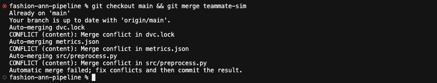</figure>
<figure>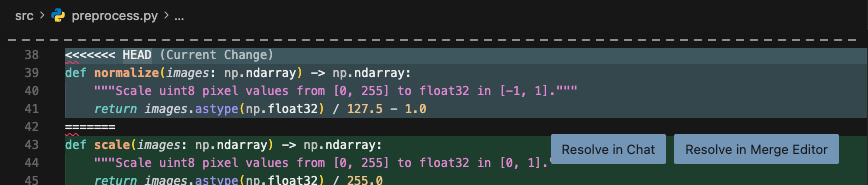<figcaption>Code conflict: <code>normalize()</code> vs <code>scale()</code> in src/preprocess.py</figcaption></figure>
</div>
<figure>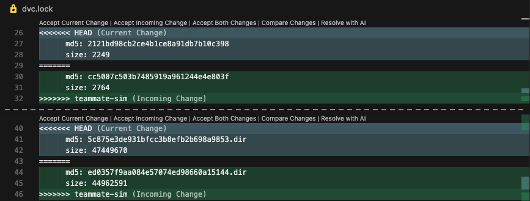<figcaption>Data conflict in dvc.lock: the preprocess.py hash and the two data/processed hashes</figcaption></figure>
</div>

**E4: resolution.** *Code:* both are affine rescalings. `main`'s only re-centres the range; `teammate-sim`'s yields zero-mean, unit-variance inputs from training-split statistics only, so val/test never leak into preprocessing. I kept `scale()` + `standardize()` and dropped `normalize()`. The 0.4-point accuracy gap is one seeded run per side, so it isn't strong evidence either way. *Data:* teammate-sim's `data/processed` (`ed0357f…`) is authoritative because it is the output of the kept code, so I took that side's `dvc.lock` and `metrics.json` hunks. `dvc checkout` then syncs the workspace to the resolved pointer.

**E5.** Merge committed as `9d5d291` (parents: E2 `b704885`, E1 `077db33`) and pushed to GitHub (the chosen data was already on Drive from E1). Re-checked on the final merged state:

<div class="ge">
<div>

```text
$ git log --oneline --graph -5
*   9d5d291 (HEAD -> main, origin/main, origin/HEAD) Merge branch 'teammate-sim'
|\
| * 077db33 (origin/teammate-sim, teammate-sim) fix: update preprocessing …
* | b704885 fix: update preprocessing normalization and adjust DVC outputs
|/
*   3fc23d2 Merge branch 'dev'
$ dvc status -c --all-branches --all-tags
Cache and remote 'gdriveremote' are in sync.
```

</div>
<div>

```text
$ dvc checkout && dvc status
Data and pipelines are up to date.
$ dvc repro
Stage 'prepare' didn't change, skipping
Stage 'preprocess' didn't change, skipping
Stage 'train' didn't change, skipping
Stage 'evaluate' didn't change, skipping
Data and pipelines are up to date.
```

</div>
</div>

Every stage's hashes match the committed `dvc.lock`, so the merged state reproduces as committed.
